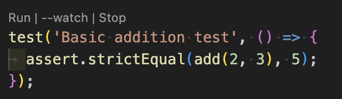
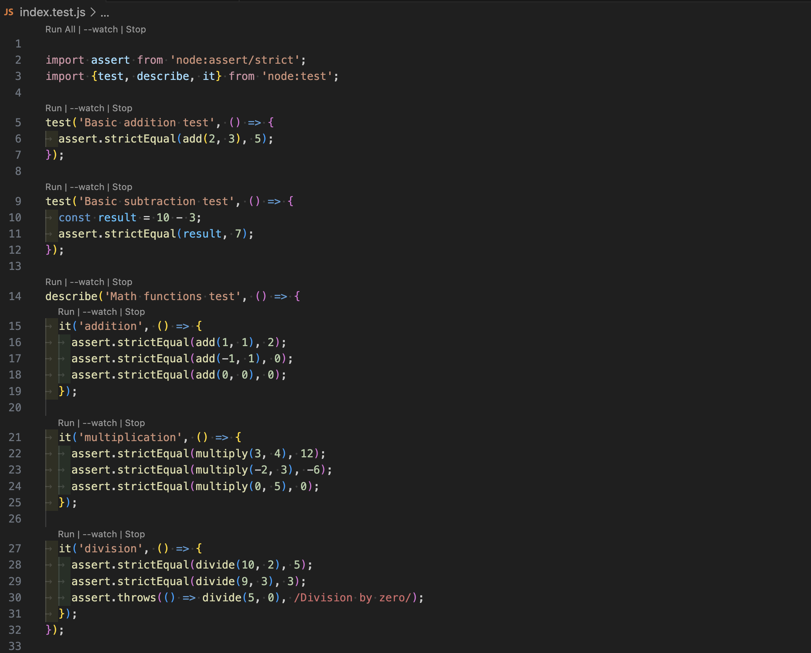

# node test runner

This VS Code extension adds inline controls above Node.js test declarations so you can execute individual tests or entire files without leaving the editor.

You can also trigger every test in the file from the header CodeLens.

## Usage

- The first line of every test file shows `Run All | --watch | Stop`. These commands run, watch, or stop all `test()` calls in the current file.
- Each `test()`, `it()`, and `describe()` line displays `Run | --watch | Stop`, letting you control a single test or suite in place.
- `Run` executes `node --test --test-name-pattern "^<test name>$" <file>`, so only the selected test runs.
- `--watch` runs `node --test --watch --test-name-pattern "^<test name>$" <file>` and reruns the same test whenever the file changes. The header `--watch` omits the pattern so the entire file is watched.
- `Stop` closes the workspace’s “Node Test Runner” terminal, ending any active watch session.
- The Command Palette exposes the same actions: `Node Test Runner: Run test`, `Run test (watch)`, `Run file`, `Run file (watch)`, and `Stop watch`.

## Features

### Run button
Shows above each test definition and executes only that test via `node --test`.

### --watch button
Runs the same command with `--watch`, rerunning on every save.

### Stop button
Disposes the dedicated terminal so the associated watch session ends immediately.
